 
## 查看主页获取源码

> **作者介绍**： **✌**全网粉丝10W+本平台特邀作者、博客专家、CSDN新星计划导师、java领域优质创作者,博客之星、掘金/华为云/阿里云/InfoQ等平台优质作者、专注于项目实战 **✌**

  

### 一、作品包含

源码+数据库+设计文档万字+PPT+全套环境和工具资源+部署教程

### 二、项目技术

前端技术：Html、Css、Js、Vue、Element-ui

数据库：MySQL

后端技术：Java、Spring Boot、MyBatis

  

### 三、运行环境Z
开发工具：IDEA/eclipse

数据库：MySQL5.7

数据库管理工具：Navicat10以上版本

环境配置软件： JDK1.8+Maven3.6.3

前端Nodejs：14

### 四、项目介绍
项目编号：springbootA097

大学生二手闲置物品置换交易管理系统是一个针对高校学生群体设计的在线平台，旨在提供一个便捷、安全的交易环境，让学生可以发布、交换或出售自己的二手闲置物品，通过物物交换或积分兑换的方式，实现资源的有效利用和循环，同时培养学生的节约意识和环保理念。

系统包括前台、后台模块以及管理员、用户和卖家的角色。

前台模块包括首页、免费物品、积分物品、公告资讯、后台管理和个人中心等功能。
后台模块包括管理员下设有系统首页、个人中心、用户管理、卖家管理、物品分类管理、免费物品管理、物品交换管理、积分物品管理、交换订单管理、签到信息管理、系统管理等功能。
用户设有系统首页、个人中心、物品交换管理、交换订单管理等功能。
卖家设有系统首页、个人中心、免费物品管理、物品交换管理等功能。

### 五、运行截图

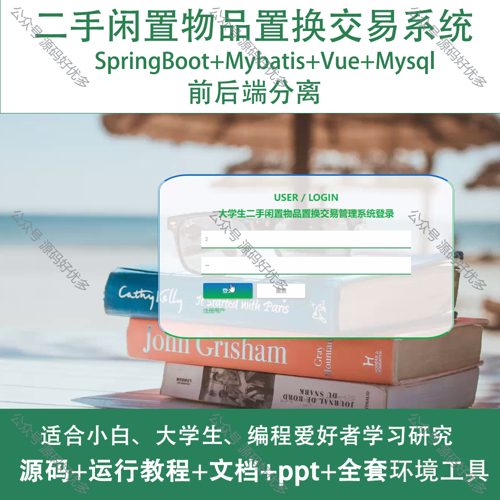
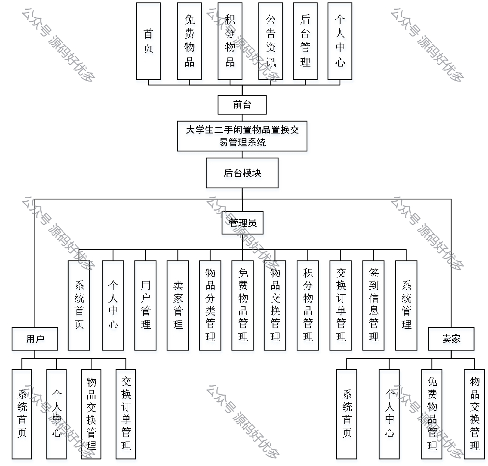
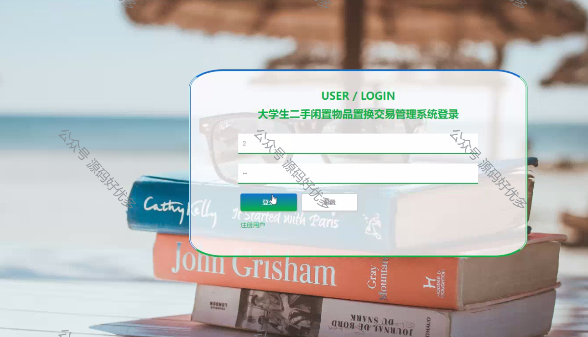
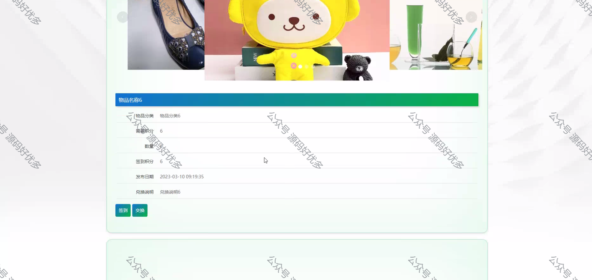
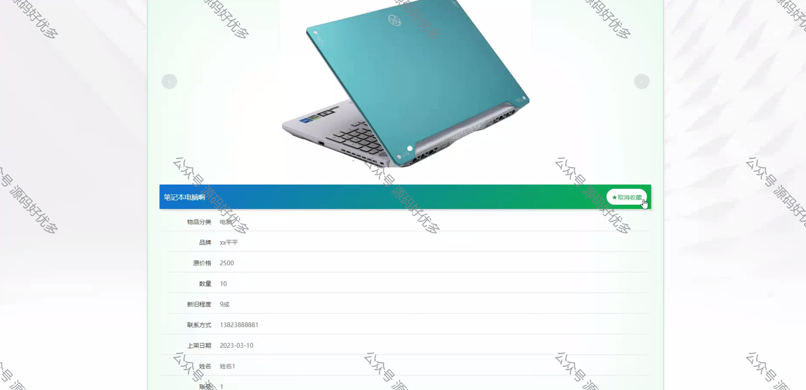
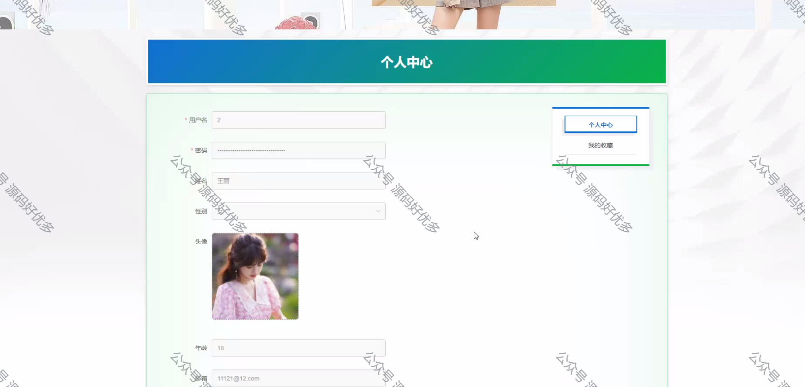
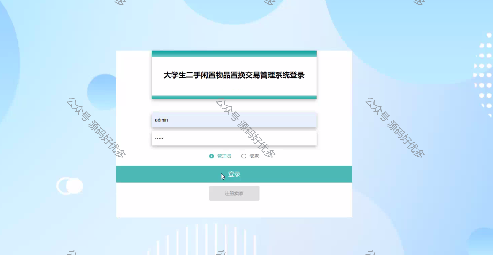
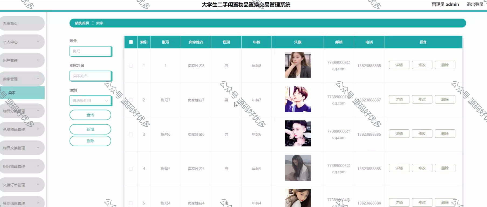
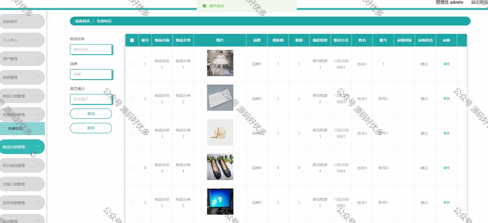
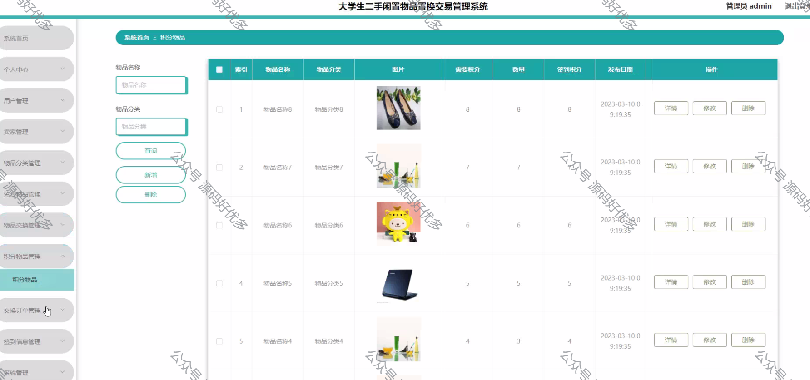
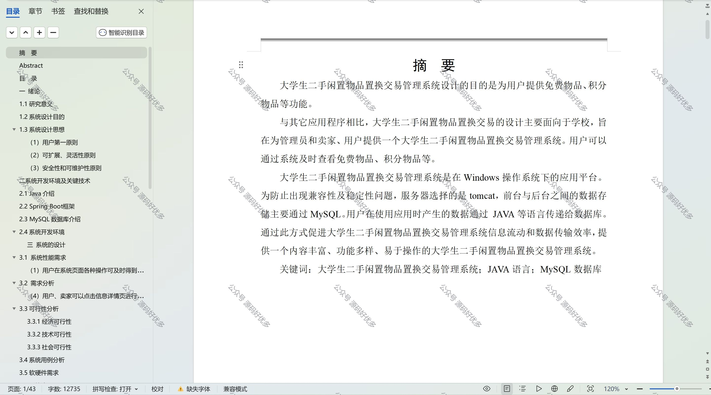

  
